# CowHeater

[[主控板PCB介绍]](pcb_mb/README.md) [[主控板代码介绍]](src_mb/README.md)

CowHeater 是一个开源的加热台，不便携。

目标在于实现一种比较通用的加热器件控制器，
同时学习可控硅控制、热电偶温度采集、PID等电子技术。

- 主控：STC8H8K64U(TSSOP-20)
- 供电方式：ACDC 集成模块
- 控制方式：可控硅斩波调功率
- 温度采集方式：K型热电偶+运放

## 购买元器件

在[立创商城BOM配单](https://bom.szlcsc.com/bom/upload.html)即可，BOM文件位于[docs/BOM_for_LCSC.csv](docs/BOM_for_LCSC.csv)

注意：

- 海凌科的电源模块长期无现货，在淘宝上购买
- 用到的STC单片机长期无现货，在淘宝上购买
- 运放和可控硅尽量在立创商城上买，淘宝假货太多了

## 进度表

1. `2023-01-06` 打算做个加热台的项目
   - PCB_V01 随便拉了线，发去嘉立创打样了
   - 淘宝和立创商城上买了一堆器件
   - 买了某仙子的PTC，后面再搞高温的MCH发热板吧
2. `2023-01-08` 等快递ing
   - BUG: 发热板热量会通过铜柱传导到PCB上面，后面需要解决
   - 靠，立创商城下单数量错了，STC单片机只买了一片
   - 靠，PCB打样的收件地址写错了，写成了上家公司，让同事寄过来了
   - 靠，烧录口没引出来，还得割线飞线
   - 有几个包裹是圆通的，还没配送

## 参考资料

### STC开发资料

- STC8H数据手册: <http://www.stcmcudata.com/STC8F-DATASHEET/STC8H.pdf>
  - P.72: STC8H8K64U-TSSOP20引脚定义
- STC-ISP下载链接: <http://www.stcmcudata.com/STCISP/stc-isp-15xx-v6.91I.zip>
- STC命令行烧录软件 stcflash: <https://github.com/sms-wyt/stcflash>

### 海凌科电源模块资料

- [HLK-2M05/2M03/2M09/2M12/2M24 2W系列AC-DC电源模块](<https://www.hlktech.com/Goods-39.html>)
- [海凌科2W系列电源模块说明书V2.6.pdf](http://r0.hlktech.com/download/ACDC%E7%94%B5%E6%BA%90%E6%A8%A1%E5%9D%972W%E7%B3%BB%E5%88%97/1/%E6%B5%B7%E5%87%8C%E7%A7%912W%E7%B3%BB%E5%88%97%E7%94%B5%E6%BA%90%E6%A8%A1%E5%9D%97%E8%AF%B4%E6%98%8E%E4%B9%A6V2.6.pdf)
