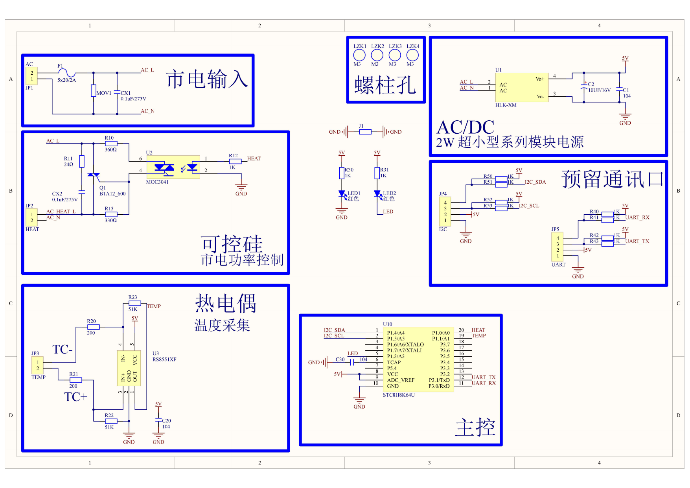
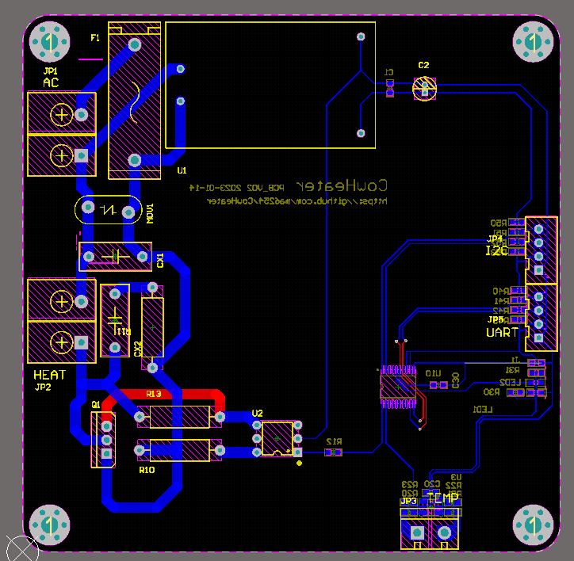

# PCB CowHeater_MB

主控板AD工程

## 目录

```plaintext
├─Backups              # 版本备份
├─CowHeater_SCH.SchDoc # 原理图
├─CowHeater_PCB.PcbDoc # PCB
├─CowHeater_PCB.PrjPcb # 工程文件
├─PcbLib1.PcbLib       # PCB封装库
└─Schlib1.SchLib       # 原理图封装库
```




## PDF to img

for windows

```powershell
# 需要先安装scoop
PS> scoop install poppler
```

```powershell
PS> pdftoppm -png .\CowHeater_SCH_V01.pdf CowHeater_SCH_V01
```

## 参考资料

- 常用AD器件库 <https://github.com/Kevincoooool/AltiumDesigner_PcbLibrary_3D>
